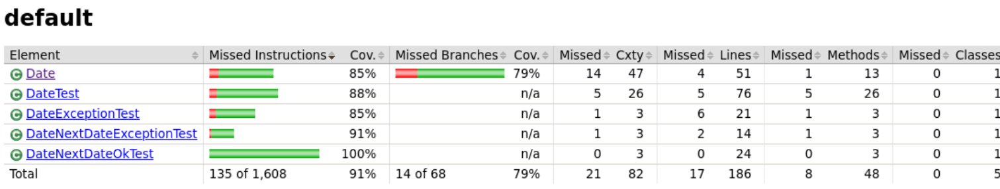
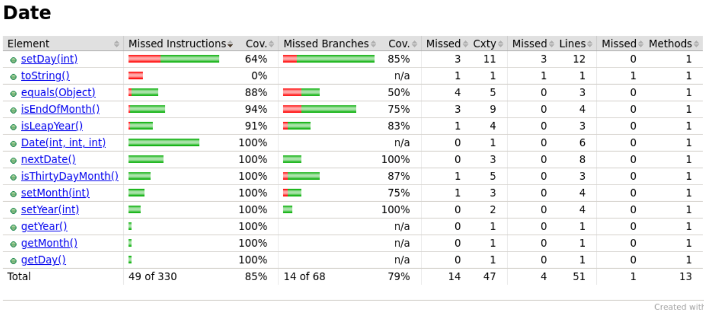

Lors de ma première exécution du rapport de couverture, j'ai obtenu des résultats moyens qui ne parvenaient pas à atteindre 100% pour la catégorie "Date".
  

j'ai été amené à effectuer des modifications sur le fichier Date.java et à intégrer de nouveaux tests. Les changements les plus significatifs ont été apportés à la méthode "private boolean isEndOfMonth()", qui a été entièrement réécrite. Suite à ces modifications, les résultats obtenus étaient satisfaisants, même après l'ajout des tests supplémentaires, et la couverture de la classe Date a atteint un taux de 100%.

  
